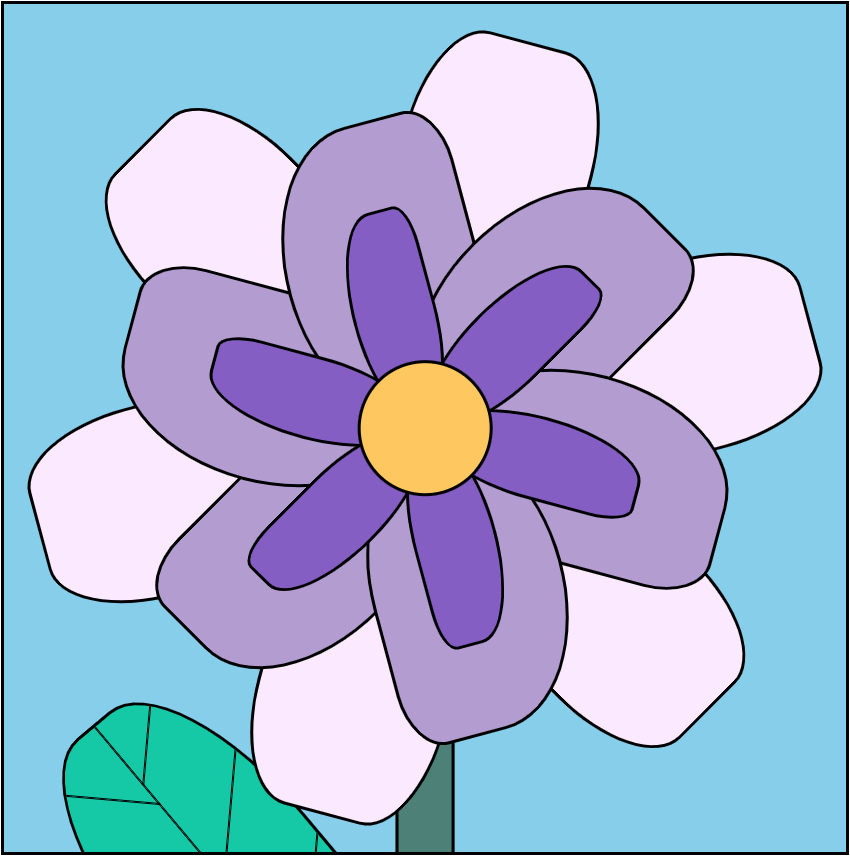
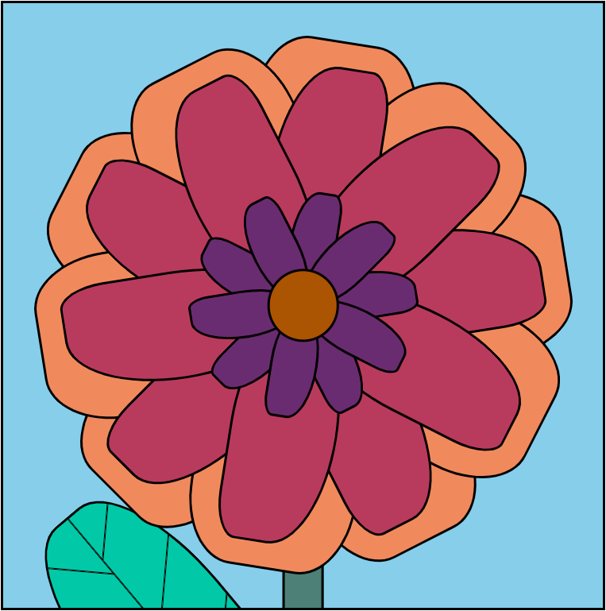

# Flowers

This a web based game of flower breeding.

The game is available at [https://hugo-sv.github.io/flowers/](https://hugo-sv.github.io/flowers/)

The goal is to understand the genetic structure of these flowers, and make the nicest flower.

Follow the instructions from the `Achievement` section to get there !
